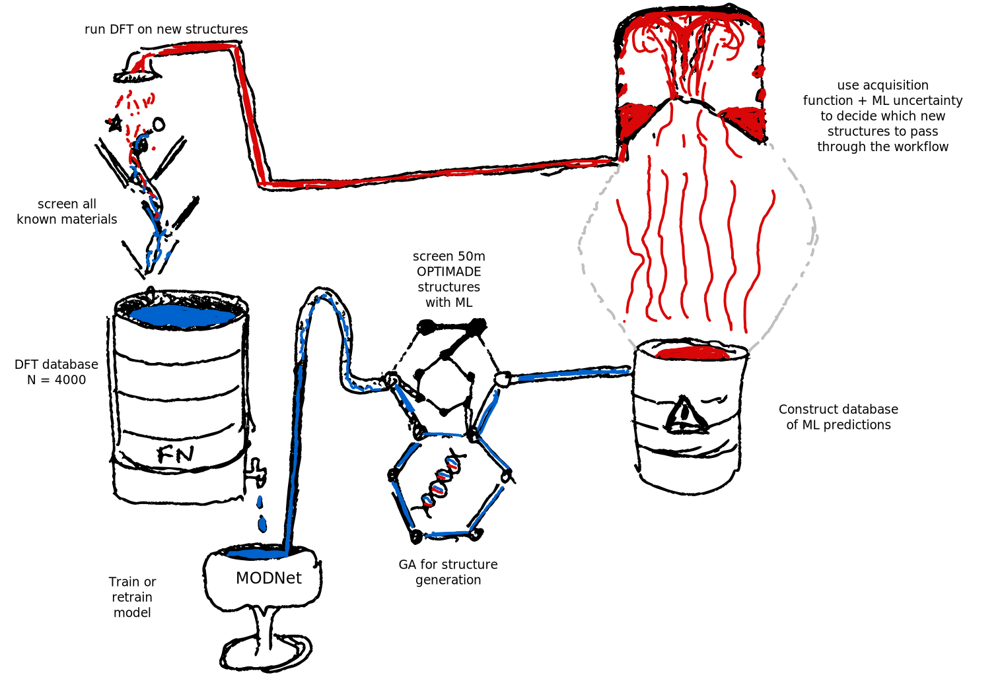

# re<sup>2</sup>fractive

The aim of this project is to design and discover materials with high refractive indices by exploiting new and existing databases, machine learning predictions (via [MODNet](https://github.com/modl-uclouvain/modnet)) and high-throughtput DFT calculations (via [atomate2](https://github.com/materialsproject/atomate2) and [jobflow-remote](https://github.com/matgenix/jobflow-remote), all within a dynamic active learning framework.

This repository contains a Python package, `re2fractive` that implements some of
this functionality, with the aim to grow it to a generic package for other
properties.

This repository accompanies the preprint:

> V. Trinquet, M. L. Evans, C. Hargreaves, P-P. De Breuck, G-M. Rignanese, "Optical materials discovery and design with federated databases and machine learning", *Faraday Discussions* (2024) DOI: [10.1039/D4FD00092G](https://doi.org/10.1039/D4FD00092G) (preprint: [10.48550/arXiv.2405.11393](https://doi.org/10.48550/arXiv.2405.11393)).

The active learning campaign described there can be repeated (modulo some
details around atomate2 & jobflow-remote setup) with:

```python
from re2fractive.campaign import Campaign, LearningStrategy
from re2fractive.datasets import NaccaratoDataset, MP2023Dataset, Alexandria2024Dataset

learning_strategy = LearningStrategy(
    max_n_features=100,
    feature_select_strategy="always",
    hyperopt_strategy="always",
)

campaign = Campaign.new_campaign_from_dataset(
    NaccaratoDataset,
    datasets=[MP2023Dataset, Alexandria2024Dataset],
    learning_strategy=learning_strategy
)

campaign.run(epochs=8)
```

Some functionality is still missing from the first public release:

- [ ] Direct integration with atomate2/jobflow-remote workflows for automatic
  job submission after candidate selection.
- [ ] Automatic selection according to custom acquisition functions.

](img/flow.svg)
